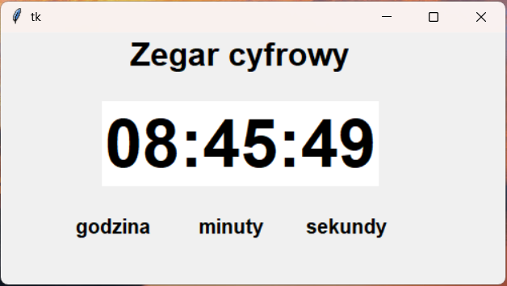

# Digital Clock – Python Tkinter

This project is a simple digital clock application created in Python using the Tkinter library.

## Description

The application displays the current system time in the format:

HH:MM:SS

The clock updates automatically every fraction of a second.

## Features

* real-time digital clock
* graphical user interface (GUI)
* automatic time refresh
* simple and clean layout

## Technologies

* Python
* Tkinter

## How to run

1. Install Python.
2. Download the project.
3. Run the script:

```bash
python digital_clock.py
```

## Screenshot


